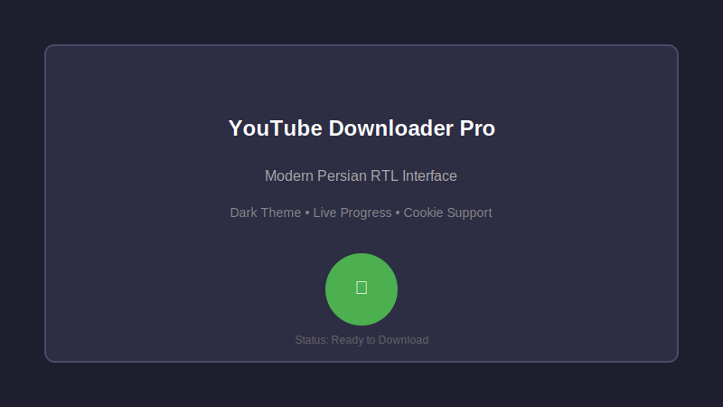
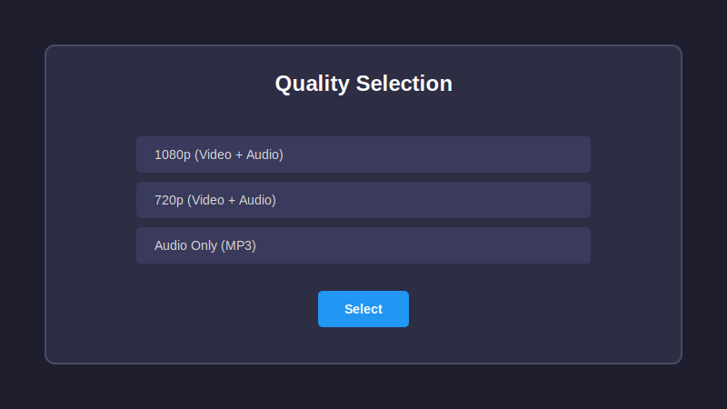
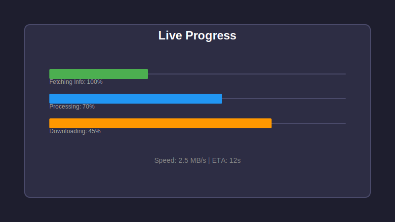

# 🎬 YouTube Downloader Pro

> An advanced YouTube downloader featuring a modern Persian RTL interface, live progress tracking, and precise quality selection.

[](https://python.org)
[](LICENSE)
[](https://github.com/Mohammad-Hasan-Kaman/youtube-downloader/releases)

---

## 🚀 Purpose & Target Audience

This project is designed for **"easy access without technical knowledge"**:

| Audience | Usage Method |
|----------|--------------|
| **Casual Users** | Download and run the standalone `.exe` file (No Python or dependencies needed). |
| **Developers** | Clone the source code to study, modify, or extend the functionality. |

---

## ✨ Key Features

- 🎨 **Modern Persian RTL UI:** Clean design with Dark Mode enabled by default.
- 📊 **Live 3-Stage Progress Bar:**
  1.  **FETCHING:** Retrieving video metadata.
  2.  **PROCESSING:** Selecting format and preparing download.
  3.  **DOWNLOADING:** Real-time speed and ETA updates.
- 🎯 **Precise Quality & Format Selection:**
  - **Video + Audio:** 1080p, 720p, 480p, etc.
  - **Audio Only:** Convert to MP3/MP4 with specific bitrates (128kbps, 192kbps, 256kbps).
  - **Video Only:** Download video without audio.
- 🔐 **Browser Cookie Support:** Bypass IP restrictions or download private videos by extracting Chrome/Firefox cookies automatically.
- 📁 **Custom Save Path:** Choose any destination folder for your downloads.
- 🧵 **Multi-threaded:** Smooth performance with non-blocking UI.
- 🛡 **Advanced Error Handling:** Clear, user-friendly error messages.

---

## 📥 Installation & Usage

### 1. For Casual Users (No Python Required)
1.  Go to the [Releases](https://github.com/Mohammad-Hasan-Kaman/youtube-downloader/releases) page.
2.  Download the latest version (`YouTube-Downloader-Pro.exe`).
3.  Run the executable.
4.  Paste the link and start downloading!

### 2. For Developers (Source Code)
```bash
# Clone the repository
git clone https://github.com/Mohammad-Hasan-Kaman/youtube-downloader.git
cd youtube_downloader

# Install dependencies (Python 3.10+ required)
pip install -r requirements.txt

# Run the application
python youtube_downloader.py
```

---

## 🛠 Tech Stack

| Technology | Role |
|------------|------|
| **Python 3.10+** | Core programming language |
| **CustomTkinter** | Modern, cross-platform GUI (RTL support) |
| **yt-dlp** | Powerful download engine & metadata extractor |
| **browser-cookie3** | Secure extraction of browser cookies |

---

## 📸 Screenshots

*Visual representation of the application interface.*

<div align="center">

| Home Screen | Quality Selection | Progress Tracking |
|:---:|:---:|:---:|
|  |  |  |

</div>

---

## 📝 How to Use

1.  **Paste Link:** Enter the YouTube URL in the input field.
2.  **Fetch Info:** Click the **"Get Info"** button to retrieve available formats.
3.  **Select Format:**
    - **Video + Audio:** Choose a format ending in `.mp4` or `.webm`.
    - **Audio Only:** Choose `.m4a` or `.mp3`.
    - **Video Only:** Select available video-only formats.
4.  **Download:** Click the **"Download"** button to start.
5.  **Monitor:** Watch the 3-stage progress bar and real-time speed.

---

## 📂 Project Structure

```
youtube_downloader/
├── assets/                  # Assets and screenshots
│   ├── screenshot_main.svg
│   ├── screenshot_quality.svg
│   └── screenshot_progress.svg
├── CHANGELOG.md             # Version history
├── CONTRIBUTING.md          # Contribution guidelines
├── LICENSE                  # MIT License
├── README.md                # Documentation
├── requirements.txt         # Python dependencies
├── youtube_downloader.py    # Main application
└── take_screenshot.py       # Screenshot generator
```

---

## 🤝 Contributing

Found a bug or have a suggestion? Please open an [Issue](https://github.com/Mohammad-Hasan-Kaman/youtube-downloader/issues).
Contributions are welcome! Please follow the guidelines in [CONTRIBUTING.md](CONTRIBUTING.md).

---

## ⭐ Support

If you find this tool useful, please give it a **star**! ⭐  
Your support motivates further development.

[](https://star-history.com/#youtube-downloader&Date)

---
*Maintained by Mohammad Hasan Kaman | Last updated: July 2026*

> **Disclaimer:** This tool is for personal and educational use only. Please respect YouTube's Terms of Service and content creators' copyright.
